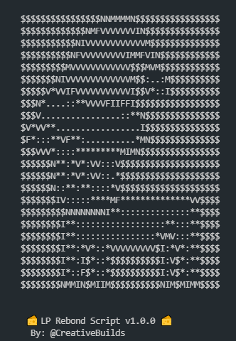

# Cheese Scripts

The following repo contains a set of NodeJS hardhat scripts provided as is under the MIT license. To get started please ensure you have [NodeJS 16+](https://nodejs.org/en/download/) if you do not. 



Once downloaded, open a terminal where the project is located and run 
```
npm install
```
When the modules are done downloading, copy and edit `.env.example` and `mnemonic.txt.example` *(12 key for a wallet)* 

[ TODO: Create a script to generate a new mnemonic ]

in `.env`, `MIN_BOND_PROFIT_PERCENT` a value of 8.5 is considered 8.5%


Try running some of the following tasks:

```shell
npm run rebond
```

## Tasks

`rebond` will check once a minute for "profitable" LP bonds. *By default this is set to 10.5% but can be changed.* Once bonds are profitable, the script takes 4 steps.

1. ) Claim any existing LP bonds
2. ) Sell half of all CHEEZ
3. ) Form LP
4. ) Deposit LP in exchange for bonds  
  

### Dev Notes
This project was originally created for [CheeseDAO.xyz](https://www.cheesedao.xyz/). To use for another project, you will need to edit the addresses inside of `.env` and also edit the RPC information in `hardhat.config.js` to your preferred network.


~ CreativeBuilds#0001 ❤

If you are one of the people who managed to find this project, hi you rock 🙋‍♂️ and may the bonds be with you 🙏
